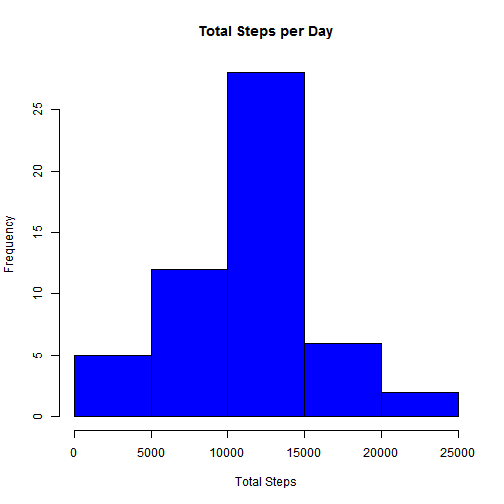
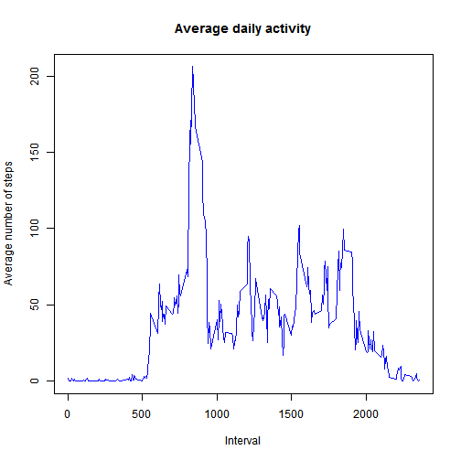
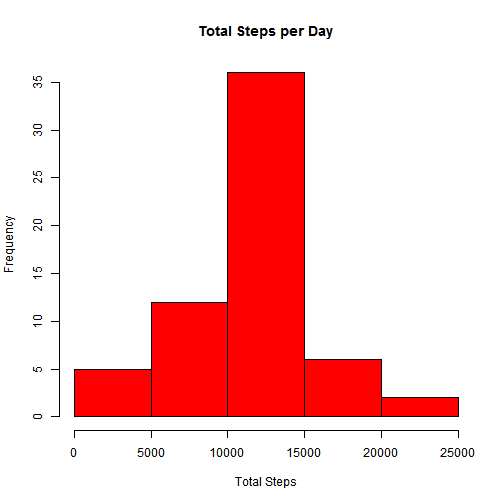
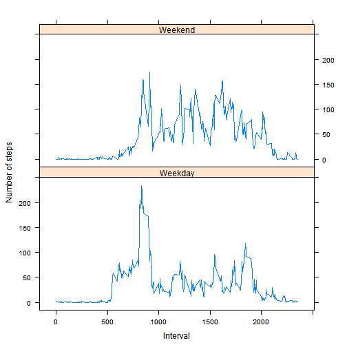

***

###Initial Data Load and Cleaning


```r
# load data (w/missing values)
data <- read.csv("activity.csv",header = TRUE)
# load data and omit missing data
data_omit_na <- na.omit(read.csv("activity.csv",header = TRUE))
# convert date column to date class
data_omit_na$date <- as.Date(data_omit_na$date)
```

***
###Total Number of Steps Taken Per Day (histogram)


```r
library(plyr)
data_omit_na.sum <- ddply(data_omit_na, c("date"), summarize,  steps = sum(steps))
hist(data_omit_na.sum$steps, col = "blue", xlab = "Total Steps", main = "Total Steps per Day")
```

 

- Mean 

```r
# Calculate mean value
mean(data_omit_na.sum$steps)
```

```
## [1] 10766.19
```

- Median

```r
# Calculate median value
median(data_omit_na.sum$steps)
```

```
## [1] 10765
```

***
###Average Daily Activity Pattern

Make a time series plot (i.e. type = "l") of the 5-minute interval (x-axis) and the average number of steps taken, averaged across all days (y-axis)

```r
groupedByInterval <- ddply(data_omit_na, ~interval, summarise, mean = mean(steps))
with(groupedByInterval, plot(interval, mean, type = "l", ylab = "Average number of steps", 
    xlab = "Interval", main = "Average daily activity", col = "blue"))
```

 

5-minute interval containing the maximum number of steps?

- Max Value

```r
#first find max value
maxVal <- max(groupedByInterval$mean)
maxVal
```

```
## [1] 206.1698
```

- Occurance of Max Value

```r
# locate the line containing this value
maxLine <- groupedByInterval[groupedByInterval$mean == maxVal, ]
# find the interval
maxInterval <- maxLine$interval
maxInterval
```

```
## [1] 835
```

***
###Compensating for Missing Values

Total number of readings with missing values

```r
# calculate sum of missing values
sum(is.na(data$steps))
```

```
## [1] 2304
```


Substitute the missing values with the corresponding daily mean


```r
# create a new dataset
data.filled <- data
# locate tha NAs
missingsteps <- is.na(data.filled$steps)
# convert interval(s) to factor(s)
data.filled$interval <- factor(data.filled$interval)
groupedByInterval$interval <- factor(groupedByInterval$interval)

# fill data.filled on missing values wherever we have a missing value, fill it
# from groupedByInterval$mean column (steps) where data.filled$interval ==
# groupedByInterval$interval (intervals are factors)
data.filled[missingsteps, "steps"] <- groupedByInterval[data.filled[missingsteps, "interval"], "mean"]
```
Total Number of Steps Taken Per Day (histogram)

```r
# group values by date
groupedByDate2 <- ddply(data.filled, ~date, summarise, sum = sum(steps))

# construct the histogram
hist(groupedByDate2$sum, xlab = "Total Steps", main = "Total Steps per Day", 
    col = "red")
```

 

- Mean 

```r
# Calculate mean value
mean(groupedByDate2$sum)
```

```
## [1] 10766.19
```

- Median

```r
# Calculate median value
median(groupedByDate2$sum)
```

```
## [1] 10766.19
```
####Discussion of Results:

- The mean as compared to the unaltered data is, as expected, unchanged. This is due to filling the data using a mean value. 
- The median as compared to the unaltered data has moved to the mean. This is also understandable since we added a large number of mean values.
- Overall the effect is minimal on the trend.

***
###Weekday vs. Weekend Activity Comparison

Create a new factor variable in the dataset with two levels - "weekday" and "weekend" indicating whether a given date is a weekday or weekend day. 

```r
# add a new column containing day of week
data_omit_na$weekday = weekdays(data_omit_na$date)
# add a new column containing either Weekday OR Weekend
data_omit_na$weekday.type <- ifelse(data_omit_na$weekday == "Saturday" | data_omit_na$weekday == 
    "Sunday", "Weekend", "Weekday")
# convert column to factor
data_omit_na$weekday.type <- factor(data_omit_na$weekday.type)
```

Make a panel plot containing a time series plot (i.e. type = "l") of the 5-minute interval (x-axis) and the average number of steps taken, averaged across all weekday days or weekend days (y-axis).

```r
# group data by interval and weekday.type
groupedBy.Interval.WeekDay <- ddply(data_omit_na, ~interval + weekday.type, summarise, 
    mean = mean(steps))

groupedBy.Interval.WeekDay$interval <- as.numeric(as.character(groupedBy.Interval.WeekDay$interval))
library(lattice)
xyplot(mean ~ interval | weekday.type, groupedBy.Interval.WeekDay, type = "l", 
    layout = c(1, 2), xlab = "Interval", ylab = "Number of steps")
```

 


